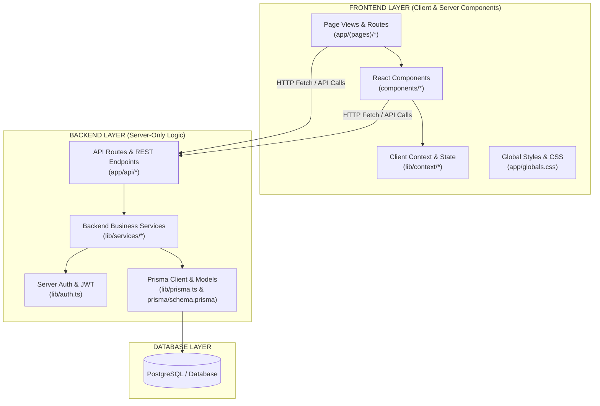

# UniGap LMS Architecture Guide

This document outlines the clear logical separation between the **Frontend** and **Backend** components in the UniGap LMS application.

---

## 1. Overview: Full-Stack Next.js Architecture

UniGap LMS is built using **Next.js 14 (App Router)**. Next.js functions as a full-stack framework where both the **Frontend UI layer** and the **Backend API / Data layer** reside within the single project repository while maintaining distinct roles and execution contexts.

---

## 2. Directory Breakdown: Frontend vs Backend

### 🎨 FRONTEND LAYER
All UI representation, client state, styling, and user interaction components.

| Directory / File | Description & Role | Path Alias |
| :--- | :--- | :--- |
| `app/**/page.tsx` | Next.js Page views (e.g. `/courses`, `/dashboard`, `/admin`) | `@/app/...` |
| `app/globals.css` | Global CSS styles, Tailwind imports, dynamic color themes | `@/app/globals.css` |
| `components/ui/` | Reusable atomic UI components (Buttons, Cards, Dialogs, Inputs, Badges) | `@frontend/ui/...` |
| `components/admin/` | Admin panels, dashboard tables, control UI widgets | `@frontend/admin/...` |
| `components/courses/` | Course listing cards, detail headers, video player UI | `@frontend/courses/...` |
| `components/dashboard/` | Learner progress cards, stat highlights, quick links | `@frontend/dashboard/...` |
| `components/gamification/` | Streak badges, XP meters, achievement popup overlays | `@frontend/gamification/...` |
| `components/layout/` | Navigation bar, sidebar, user avatar menus, footer | `@frontend/layout/...` |
| `components/marketing/` | Hero section, landing page banners, call-to-action blocks | `@frontend/marketing/...` |
| `lib/context/` | React Context providers (AuthContext, ThemeContext) | `@frontend/context/...` |

---

### ⚙️ BACKEND LAYER
All server-side business logic, API route endpoints, authentication handler functions, and database schemas.

| Directory / File | Description & Role | Path Alias |
| :--- | :--- | :--- |
| `app/api/**/route.ts` | Server REST API Endpoints (e.g. `/api/auth/login`) | `@/app/api/...` |
| `lib/services/` | Backend business services handling data access & domain logic | `@backend/*` or `@/lib/services/*` |
| `lib/services/auth.service.ts` | Authentication service functions | `@backend/auth.service` |
| `lib/services/course.service.ts` | Course management service & query helpers | `@backend/course.service` |
| `lib/services/admin.service.ts` | Admin analytics & user management service | `@backend/admin.service` |
| `lib/services/user-progress.ts` | Progress tracking & XP calculation service | `@backend/user-progress` |
| `lib/auth.ts` | Server-side JWT token generation & password encryption verification | `@backend/auth` |
| `lib/prisma.ts` | Prisma ORM singleton client instance connection | `@backend/prisma` |
| `prisma/schema.prisma` | Database schema models (Users, Courses, Transactions, Certificates) | `@backend/schema.prisma` |
| `prisma/seed.ts` | Database initialization and seeding script | N/A |

---

## 3. Communication Pattern

1. **Client to Backend API Route**:
   - React components initiate an HTTP `fetch('/api/auth/login', { method: 'POST', body: ... })`.
   - The Backend API Handler (`app/api/auth/login/route.ts`) handles request parsing, validation, authentication (`lib/auth.ts`), and queries the database via Prisma (`lib/prisma.ts`).
   - Returns a structured JSON response to the client.

2. **Server-Side Data Fetching (RSC)**:
   - Server Components in `app/` can directly invoke backend services in `lib/services/` to fetch data during render time without extra HTTP overhead.

---

## 4. Path Aliases (`tsconfig.json`)

To explicitly maintain clear boundaries when importing modules across your codebase, the following aliases are configured in `tsconfig.json`:

- `@/` $\rightarrow$ Root path (`./`)
- `@frontend/` $\rightarrow$ Points to frontend components & contexts (`./components/*`, `./lib/context/*`)
- `@backend/` $\rightarrow$ Points to backend services & database models (`./lib/services/*`, `./lib/prisma.ts`, `./lib/auth.ts`, `./prisma/*`)

---

## 5. Guidelines for Adding New Features

- **Adding a new UI component or page view**:
  - Place visual React components in `components/<feature>/` (Frontend).
  - Place page routes in `app/<route>/page.tsx` (Frontend).

- **Adding a new database table or API endpoint**:
  - Update database models in `prisma/schema.prisma` (Backend).
  - Add backend business logic in `lib/services/<feature>.service.ts` (Backend).
  - Create REST route handlers in `app/api/<feature>/route.ts` (Backend).
