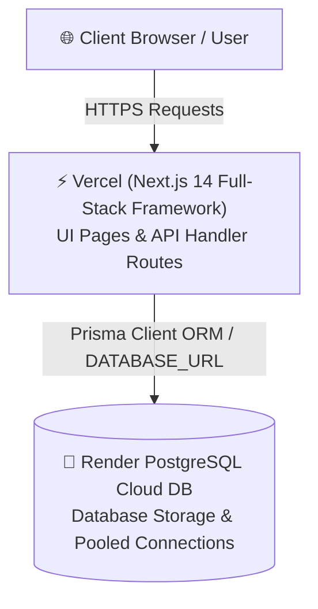

# 📋 UniGap LMS - Final Completion & Deployment Task Sheet

> **Project Goal**: Complete all core LMS modules, deploy the PostgreSQL database to **Render**, host the Next.js full-stack app on **Vercel**, and showcase the project using the **4 Dummy Test Accounts**.

---

## 🏗️ Architecture Overview



---

## 📝 Phase-by-Phase Task Checklist

### Phase 1: Database & Backend Initialization (Render & Prisma)
- [ ] **Task 1.1**: Set up PostgreSQL instance on [Render.com](https://render.com).
- [ ] **Task 1.2**: Obtain Render PostgreSQL connection string (ensure `?sslmode=require` is attached).
- [ ] **Task 1.3**: Configure local & production `.env` with `DATABASE_URL` and `JWT_SECRET`.
- [ ] **Task 1.4**: Validate Prisma schema (`prisma/schema.prisma`) with all models (`User`, `Instructor`, `Course`, `Module`, `Lesson`, `Quiz`, `Enrollment`, `Certificate`, `Transaction`, `Achievement`, `UserStats`).
- [ ] **Task 1.5**: Run database push to apply schema to Render DB:
  ```bash
  npx prisma db push
  ```
- [ ] **Task 1.6**: Execute seed script to populate initial platform data & dummy accounts:
  ```bash
  npx tsx prisma/seed.ts
  ```

---

### Phase 2: Authentication & User Management
- [ ] **Task 2.1**: Test user registration (`/register`) and login (`/login`).
- [ ] **Task 2.2**: Verify JWT token generation & session cookies (`lib/auth.ts`, `middleware.ts`).
- [ ] **Task 2.3**: Verify Role-Based Access Control (RBAC):
  - `SUPER_ADMIN`: Access to `/admin`, full system management.
  - `ADMIN`: Access to course & content management.
  - `STUDENT`: Access to `/dashboard`, `/courses`, `/certificates`, `/achievements`.
- [ ] **Task 2.4**: Verify Profile page (`/profile`) and Settings page (`/settings`).

---

### Phase 3: Learning Experience & Course Engine
- [ ] **Task 3.1**: Course Catalog listing (`/courses`) with search and category filtering.
- [ ] **Task 3.2**: Course detail & enrollment flow (`/courses/[slug]`).
- [ ] **Task 3.3**: Interactive Video & Reading lesson player (`/courses/[slug]/lessons/[lessonId]`).
- [ ] **Task 3.4**: Lesson quiz completion modal and auto-grading logic.
- [ ] **Task 3.5**: Lesson completion progress tracking & user state persistence.

---

### Phase 4: Gamification & Automated Certificates
- [ ] **Task 4.1**: Gamification system (`/achievements`): XP tracking, Level calculation, and Streak counting.
- [ ] **Task 4.2**: Achievement unlock triggers upon completing lessons and quizzes.
- [ ] **Task 4.3**: Certificate generation (`/certificates`):
  - Auto-issue certificate upon 100% course completion.
  - Unique certificate ID generation.
  - PDF export / print preview (`jspdf` / `html2canvas`).

---

### Phase 5: Admin Panel & Student Registry
- [ ] **Task 5.1**: Admin Overview Dashboard (`/admin`) displaying user metrics, active courses, and revenue.
- [ ] **Task 5.2**: Registered Students query view and role switcher.
- [ ] **Task 5.3**: Course & Module management interface.

---

### Phase 6: Vercel Cloud Deployment
- [ ] **Task 6.1**: Push codebase to GitHub (`Kavinipremarathna/Unigap_Lms`).
- [ ] **Task 6.2**: Import GitHub repository into [Vercel](https://vercel.com).
- [ ] **Task 6.3**: Set Vercel Environment Variables:
  - `DATABASE_URL` = `postgresql://<user>:<password>@<render-host>/<dbname>?sslmode=require`
  - `JWT_SECRET` = `<your-production-jwt-secret>`
  - `NEXT_PUBLIC_APP_URL` = `https://<your-app-name>.vercel.app`
- [ ] **Task 6.4**: Verify Build & Deployment Settings:
  - Framework Preset: Next.js
  - Build Command: `npx prisma generate && next build`
- [ ] **Task 6.5**: Trigger Vercel Production Build and test live domain URL.

---

## 🔑 Phase 7: Live Showcase - "The Dummy 4" Test Personas

Use these **4 seeded test accounts** to demonstrate all features during project presentation.

Default Password for all dummy accounts: **`Unigap@123`**

| Persona # | Role | Email | Key Showcase Features |
| :--- | :--- | :--- | :--- |
| **Persona 1** | **Super Admin** | `superadmin@unigap.edu` | Full platform administration, system settings, global metrics. |
| **Persona 2** | **Executive Admin** | `kkgpremarathna@gmail.com` | Executive oversight, student registry lookup, certificate logs. |
| **Persona 3** | **Course Admin** | `admin@unigap.edu` | Course creation, module uploading, lesson publishing. |
| **Persona 4** | **Test Student** | `student@unigap.edu` | Course enrollment, video watching, quiz completion, XP streak, PDF certificate download. |

---

## 📊 Project Completion Summary Checklist

| Task Group | Status | Priority | Responsible |
| :--- | :--- | :--- | :--- |
| 1. Render PostgreSQL DB Provisioning | ⏳ Pending | High | Backend Lead |
| 2. Prisma Schema Sync & Seeding | ⏳ Pending | High | Backend Lead |
| 3. Auth & Role Routing | ✅ Ready | Critical | Full Stack |
| 4. Student Learning UI & Video Player | ✅ Ready | High | Frontend Lead |
| 5. Gamification & Certificate PDF | ✅ Ready | Medium | Frontend Lead |
| 6. Vercel Production Deployment | ⏳ Pending | High | DevOps |
| 7. Dummy 4 Demonstration Test | ⏳ Pending | High | Quality Assurance |

---

> [!TIP]
> Keep this task sheet open as you complete each deployment step. Check off completed items as you deploy to Render and Vercel!
